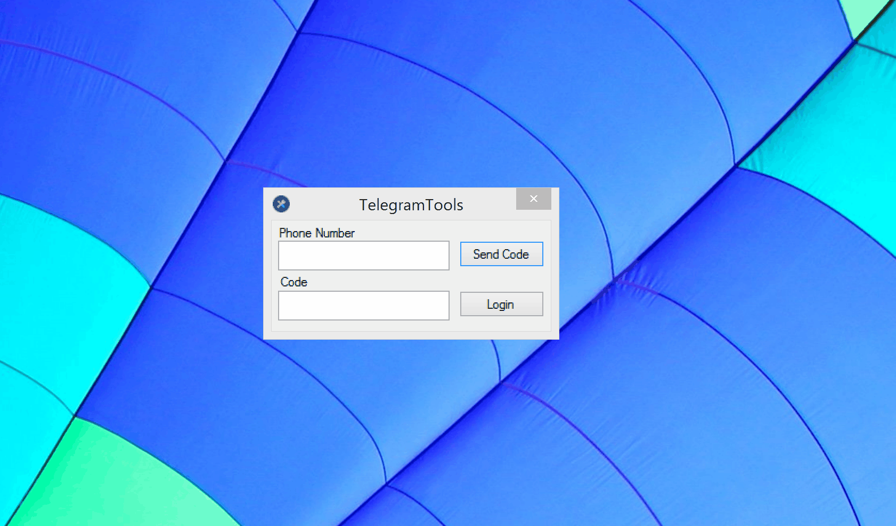

# Telegram Tools

Hi guys! This is Telegram Bulk Sender, written on C#. 

<a href="https://github.com/sochix/telegram-tools/raw/master/TelegramTools-1.0.0.zip">Download Latest Version</a>

I take my C# Telegram client [TLSharp](https://github.com/sochix/TLSharp) and made user friendly UI for it. Yes I do it for you, my lovely users, that have many difficulties with console and writing code.

In this time I don't want to open source it, you should use it AS-IS.

All of your data stored localy, app send data ONLY to Telegram servers.

New features will be available on-demand.

### Comments
Be sure `session.dat` is available for READ/WRITE. 

### Warning!
The End-User assumes responsibility for anything resulting from the use of this program. I can't give 100% guaranty that you will not be banned.

### Different version?
If you want "Full" version - make ANY donation, then contact me (@sochix) and I will send you the FULL verson.

Difference (Full vs GitHub): "Unlimited number of users to send message. Faster message delivery".

If you want source code of this program - contact me, price is 100$.

